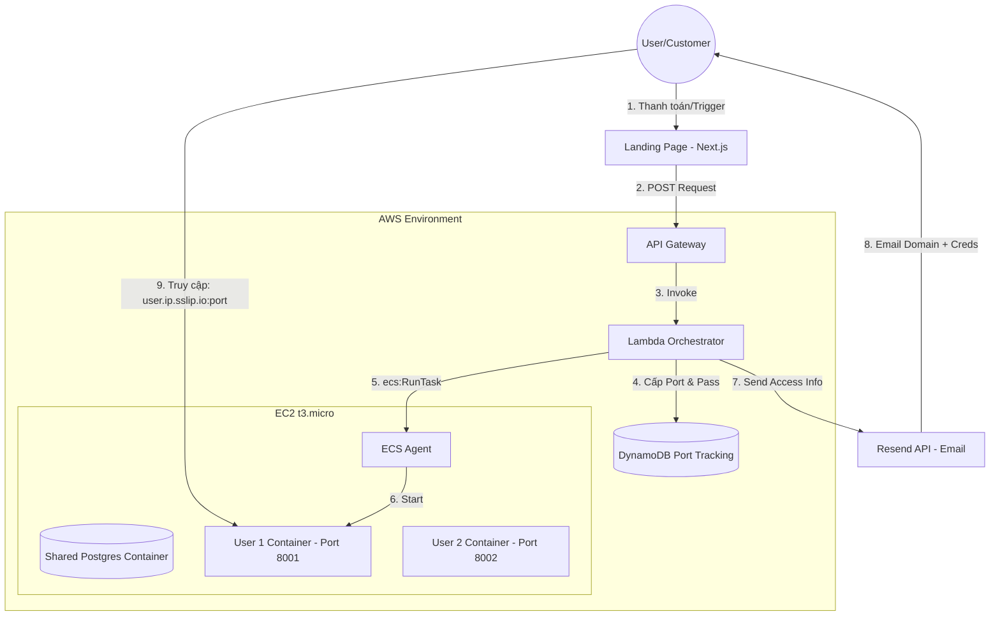

# AWS Workflow Automation Diagram

Copy and paste this code into [Mermaid Live Editor](https://mermaid.live/) or an Excalidraw Mermaid pane.

## Architectural Notes for Tech Lead
- **Cost Efficiency:** Utilizes AWS Free Tier (EC2 t3.micro) by avoiding Fargate and ALB costs.
- **Scalability:** Vertical scaling is limited by RAM (1GB). Horizontal scaling can be achieved by adding more EC2 instances to the ECS Cluster.
- **DNS Strategy:** Uses `sslip.io` to provide immediate, zero-config subdomains for testing without paying for Route 53 or external domains.
- **Tenant Isolation:** Containers provide process and network isolation. Shared Postgres reduces overhead while maintaining logical data separation via unique database names.
